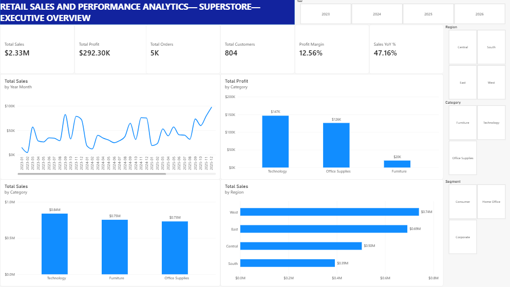
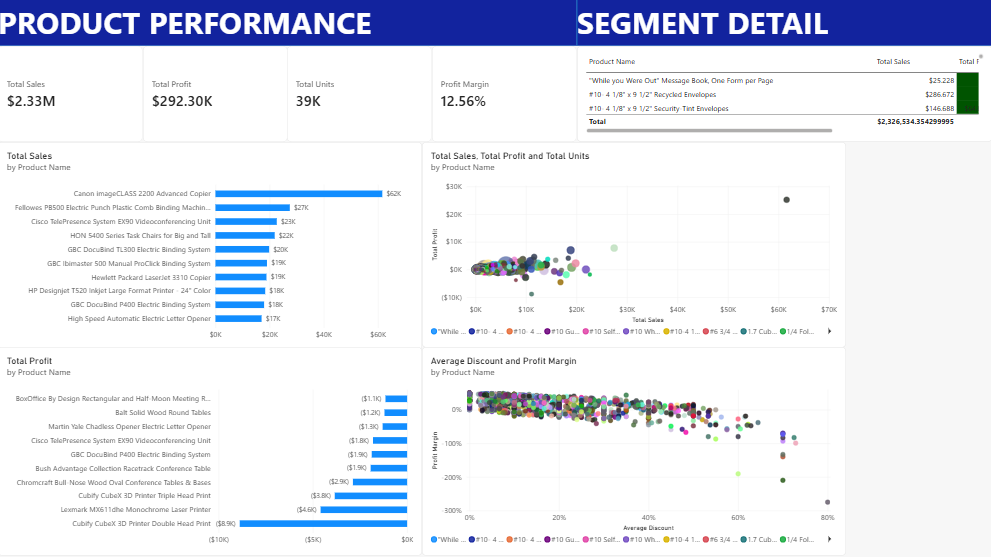
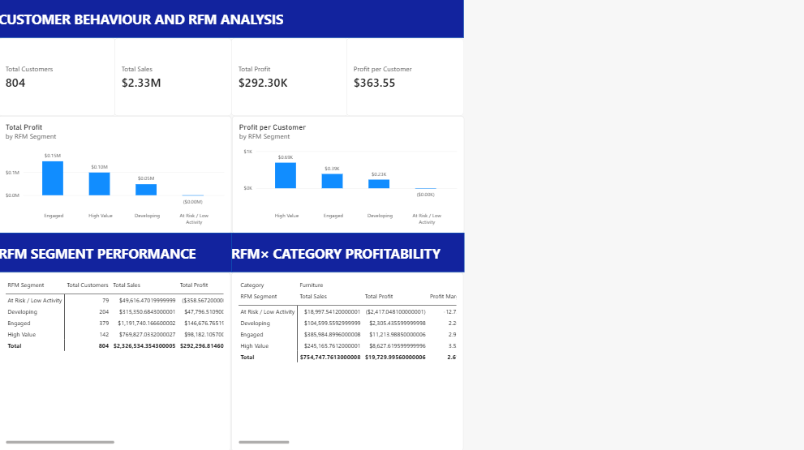
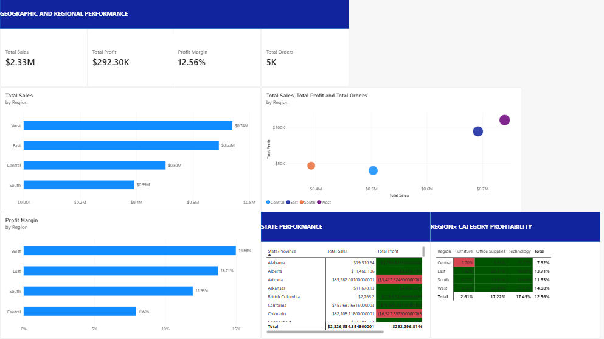

# TAN WIN JIUN– DATA ANALYST PORTFOLIO
### Welcome~! This portfolio showcases projects demonstrating data analysis, business intelligence and dashboard development skills using Microsoft Excel, SQL and Power BI.
## Projects
**1. Retail Sales And Performance Analytics— Superstore(2023— 2026)**

**Project Overview**

This project analyses the Superstore retail dataset using **Power BI, DAX, data modelling and SQL** to investigate sales performance, profitability, customer behaviour, product performance and regional variation.

The project was designed as a **hypothetical retail business case** using a publicly available Superstore dataset.

The analysis focuses on a central business question:

**How is the business performing, and where are the key areas requiring further investigation?**

* * *

## Dashboard Previews

### 1. Executive Overview

### 2. Product Performance

### 3. Customer Behaviour And RFM Analysis

### 4. Geographic And Regional Performance

* * *

**Business Objectives**

The analysis was designed to answer:

-   How are sales and profit performing over time?
-   Which product categories generate the most revenue and profit?
-   Which products contribute strongly to sales but weakly to profit?
-   How does customer value vary across customer groups?
-   What does RFM-style segmentation reveal about customer behaviour?
-   Which regions generate the most revenue and profit?
-   Where are profitability differences concentrated?
-   How do category economics vary across customer segments and regions?

* * *

**Tools And Technologies**

-   **Power BI Desktop**
-   **Power Query**
-   **DAX**
-   **SQL**
-   Data modelling
-   Dimensional modelling
-   Customer segmentation
-   RFM-style analysis
-   Exploratory data analysis
-   Data visualisation

* * *

**Data Preparation**

The raw Superstore dataset was imported and transformed before analysis.

Key preparation steps included:

-   Validating column data types
-   Treating Postal Code as an identifier rather than a numerical measure
-   Checking missing values
-   Preserving legitimate transaction-level records
-   Avoiding duplicate removal based solely on Order ID
-   Creating a dedicated Date dimension
-   Establishing a one-to-many relationship between the Date dimension and sales fact table
-   Creating reusable DAX measures for business KPIs

The main sales table was modelled as:

Fact\_Sales

with a dedicated date dimension:

Dim\_Date

* * *

**Data Model**

The core model follows a simple dimensional structure:

Dim\_Date

│

│ 1 : \*

▼

Fact\_Sales

A separate customer-level analytical table was created for customer behaviour and RFM-style analysis:

Customer\_Analysis

* * *

**Key Measures**

Examples of the DAX measures developed include:

Total Sales =

SUM(Fact\_Sales\[Sales\])

Total Profit =

SUM(Fact\_Sales\[Profit\])

Total Orders =

DISTINCTCOUNT(Fact\_Sales\[Order ID\])

Total Customers =

DISTINCTCOUNT(Fact\_Sales\[Customer ID\])

Profit Margin =

DIVIDE(

\[Total Profit\],

\[Total Sales\]

)

Average Order Value =

DIVIDE(

\[Total Sales\],

\[Total Orders\]

)

Additional measures were developed for customer value, regional performance, profitability and year-over-year analysis.

* * *

**Dashboard Pages**

**1\. Executive Overview**

The executive page provides a high-level view of:

-   Sales
-   Profit
-   Profit margin
-   Orders
-   Customers
-   Year-over-year sales growth
-   Monthly sales trends
-   Category performance
-   Regional profitability

**2\. Product Performance**

This page investigates:

-   Top products by sales
-   Bottom products by profit
-   Product-level sales and profitability
-   Sales versus profit
-   Discounting
-   Product margins
-   Units sold

**3\. Customer Behaviour And RFM Analysis**

The customer analysis includes:

-   New versus repeat customers
-   Customer purchasing behaviour
-   Recency
-   Frequency
-   Monetary value
-   RFM-style segmentation
-   Customer profitability
-   RFM segment × category profitability

**4\. Geographic And Regional Performance**

The regional analysis examines:

-   Regional sales
-   Regional profit
-   Profit margin
-   Sales per customer
-   Orders per customer
-   Profit per order
-   State-level performance
-   Region × category profitability

* * *

**Key Findings**

**Sales Growth**

Sales declined by **4.26% in 2024**, followed by growth of **29.80% in 2025** and a further **21.44% in 2026**.

This shows a recovery followed by continued year-over-year growth in the later periods of the dataset.

**Customer Segment Performance**

Consumer generated the highest sales at approximately **$1.17M** and the highest total profit at approximately **$136K**.

However, Consumer's profit margin was **11.65%**, compared with **13.17% for Corporate** and **14.02% for Home Office**.

This demonstrates that revenue contribution and profitability rate can provide different perspectives on segment performance.

**Category Profitability**

Furniture recorded substantially lower margins than Office Supplies and Technology across customer segments and regions.

Furniture margins by customer segment were:

-   Consumer: **1.91%**
-   Corporate: **3.39%**
-   Home Office: **3.37%**

Central Furniture was particularly weak, recording a **\-1.70% margin**.

This makes Furniture a key area for further investigation into product-level economics, discounting and order characteristics.

**Customer Value**

The RFM-style analysis identified four analytical customer groups.

The **142 High Value customers** generated approximately **$769.8K in sales** and **$98.2K in profit**, equivalent to approximately **$691 profit per customer**.

The **79 At Risk / Low Activity customers** generated approximately **$49.6K in sales** and an overall loss of approximately **$359**.

The analysis also demonstrates that margin percentage and absolute customer profitability are different measures.

**Regional Performance**

West recorded the highest sales at approximately **$739.8K** and the highest total profit at approximately **$110.8K**.

Central generated approximately **$503.2K in sales**, but its **7.92% profit margin** was substantially lower than the other regions.

Central also recorded the lowest profit per order at approximately **$33.81**.

Category analysis showed that the Central profitability gap was concentrated particularly in Furniture and Office Supplies, while Technology recorded a **19.77% margin**.

* * *

**Analytical Approach**

The project follows the analytical workflow:

Raw Data

↓

Data Cleaning

↓

Data Modelling

↓

DAX Measures

↓

Descriptive Analysis

↓

Customer Analysis

↓

RFM-style Segmentation

↓

Regional And Product Analysis

↓

Business Insights

The analysis deliberately distinguishes between **observed patterns and causal explanations**.

For example, a relationship between discounting and profitability is treated as an association requiring further investigation rather than proof that discounting caused the difference.

* * *

**RFM Methodology**

The initial RFM model uses a simple five-point scoring framework for:

-   Recency
-   Frequency
-   Monetary value

Customers receive a combined score from **3 to 15**, which is then grouped into four analytical segments:

-   High Value
-   Engaged
-   Developing
-   At Risk / Low Activity

These thresholds are **portfolio-analysis assumptions based on the observed dataset**, rather than universal customer-lifecycle definitions.

A future version of the analysis could use quintile-based scoring to reduce dependence on manually defined thresholds.

* * *

**Important Limitations**

-   Superstore is a sample dataset and does not represent an actual Malaysian retail business.
-   The analysis should therefore be interpreted as a hypothetical business case.
-   RFM segment thresholds are analytical assumptions.
-   Observed relationships do not establish causality.
-   Historical dataset trends should not automatically be interpreted as forecasts.
-   Profitability analysis is based on the profit field supplied by the dataset.

* * *

**Project Structure**

Retail\_Analytics\_Portfolio/

│

├── data/

│└── Sample\_-\_Superstore.xls

│

├── sql/

│└── sales\_analysis.sql

│

├── powerbi/(Available Upon Requests)

│└── retail\_dashboard.pbix(Available Upon Requests)

│

├── screenshots/

│├── executive\_overview.png

│├── product\_performance.png

│├── customer\_behaviour.png

│└── regional\_analysis.png

│

└── README.md

* * *

**Portfolio Skills Demonstrated**

This project demonstrates practical experience in:

-   Power BI dashboard development
-   Power Query data preparation
-   DAX calculations
-   Data modelling
-   KPI development
-   Time-series analysis
-   Customer analytics
-   RFM-style segmentation
-   Product profitability analysis
-   Regional analysis
-   Exploratory data analysis
-   Business insight development
-   Analytical storytelling

* * *

**Conclusion**

This project demonstrates an end-to-end approach to transforming transactional retail data into an interactive analytical solution.

Rather than focusing only on sales volume, the analysis combines **growth, profitability, product performance, customer behaviour and geography** to identify patterns and areas requiring further investigation.

* * *
